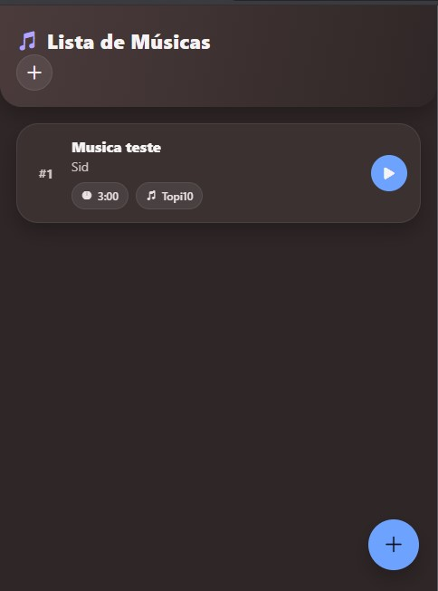
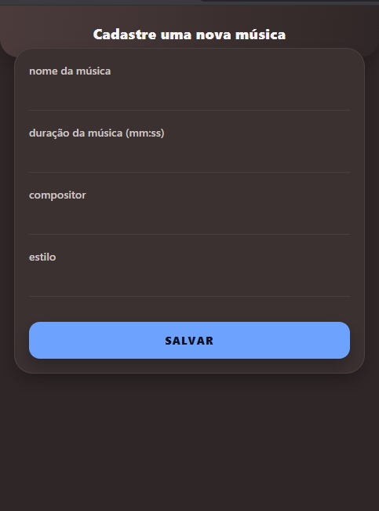

## Grupo: Akaz Guerra, Maria Clara Correa Adorno, Mateus Azevedo e Raquel de Almeida Silva

#  Projeto Playlist App (Cadastro de Músicas)

Aplicativo React Native desenvolvido em **Expo**, que permite cadastrar músicas, listar e consumir dados de uma API local (JSON Server) exposta na internet através do **ngrok**.

# Funcionalidades

-  Listar músicas vindas da API (`/songs`)
-  Cadastrar novas músicas (título, artista, duração e gênero)
-  Atualização automática da lista ao cadastrar
-  Integração com **JSON Server** + **ngrok** para rodar em celular real via rede

## ⚙️ Tecnologias Usadas

- [React Native](https://reactnative.dev/)
- [Expo](https://expo.dev/)
- [Axios](https://axios-http.com/)
- [JSON Server](https://github.com/typicode/json-server)
- [ngrok](https://ngrok.com/)

---

## Instalação

1. Rode no terminal:
   ```bash
   npm install
   npx expo install expo-linear-gradient
   ```

2. Crie um arquivo `db.json` em uma pasta separada, por exemplo:
   ```
   C:\api-fake-json\db.json
   ```

3. Com o conteúdo:
   ```json
   {
     "songs": [
       { "id": 1, "title": "Primeira Música", "artist": "Autor", "duration": "03:45", "genre": "Pop" }
     ]
   }
   ```

4. Depois rode o servidor:
   ```bash
   cd C:\api-fake-json
   npx json-server --watch db.json --port 8000
   ```

5. Rodar o app:
   ```bash
   npx expo start
   ```

---

# Preview



